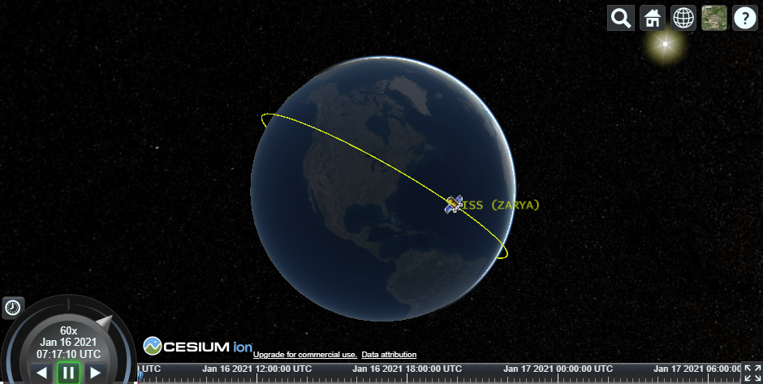
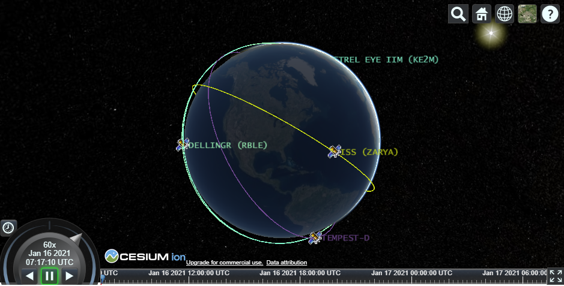
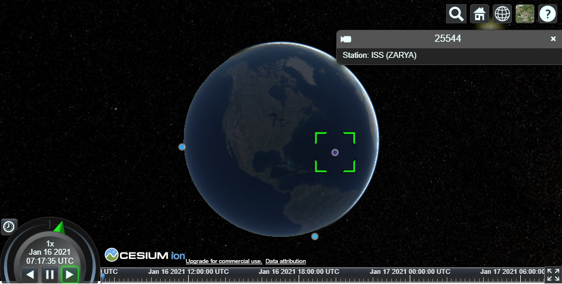
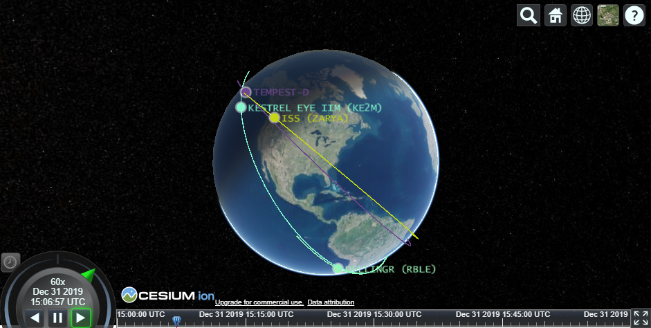
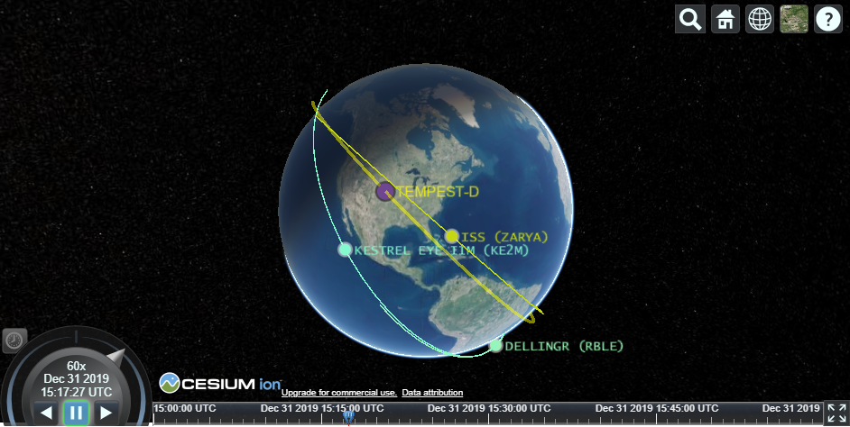

# Satellite CZML
Creates a CZML string based on TLE (Two Line Element set) data for plotting satellites on the open source [CesiumJS](https://cesium.com/cesiumjs/) JavaScript library.

# Background
CesiumJS is a WebGL earth modeling engine which allows for time annimated displays of satellites using 3D and 2D interactive maps in the web browser.  A CZML file/string is used by CesiumJS to show a time animation such as in this [example](https://sandcastle.cesium.com/?src=CZML.html).  Each [Two-Line Element set (TLE)](https://www.celestrak.com/NORAD/documentation/tle-fmt.php) contains orbit information for a single satellite.  Since satellites drift and maneuver, these become out-of-date and new TLEs must be published.  [Space-Track.org](https://www.space-track.org/) is an excellent resource for getting up-to-date and historic TLE data via their free API.  There is also a [spacetrack](https://pypi.org/project/spacetrack/) python package which interfaces with this API for you.

## Installation
`pip install satellite-czml`

## Usage
This library contains two classes to aid in the generation of CZML strings.

- `satellite_czml` - Takes either TLE data or `satellite` objects and builds CZML string
- `satellite` - Contains the satellite object that will be used in the CZML generation

For a Jupyter notebook example, please look at [example_usage.ipynb](./example_usage.ipynb).  The notebook also contains an example how to use Plotly Dash with Cesium.

### Simple Example (one satellite)
`tle_list` must be a list of lists.  Each element is a TLE entry and each TLE entry is broken up into either two or three elements.  If the TLE entry is only two elements, a separate `name_list` must also be provided.

```Python
from satellite_czml import satellite_czml

single_tle = [['ISS (ZARYA)',
               '1 25544U 98067A   21016.23305200  .00001366  00000-0  32598-4 0  9992',
               '2 25544  51.6457  14.3113 0000235 231.0982 239.8264 15.49297436265049']]

czml_string = satellite_czml(tle_list=single_tle).get_czml()
```



### Multiple Satellite Example
The same works method works whith multiple TLE entries

```Python
from satellite_czml import satellite_czml

czml_string = satellite_czml(tle_list=multiple_tle).get_czml()
```



### Specifying Argument Lists
```Python
from satellite_czml import satellite_czml
from datetime import datetime, timedelta
import random

name_list = [t[0] for t in multiple_tle] 
description_list = ['Station: ' + t[0] for t in multiple_tle]
color_list = [[random.randrange(256) for x in range(3)] for x in range(len(multiple_tle))]
size_list = [7] * len(multiple_tle)

czml_obj = satellite_czml(tle_list=multiple_tle, name_list=name_list, description_list=description_list,
                          color_list=color_list, speed_multiplier=1, use_default_image=False,
                          marker_scale_list=size_list, show_label=False, show_path=False,
                          ignore_bad_tles=True)
czml_string = czml_obj.get_czml()
```



### Create Satellites One-by-One
```Python
from satellite_czml import satellite_czml
from satellite_czml import satellite

multiple_sats=[]
for tle in small_tle_list:
    sat = satellite(tle,
                    description='Station: ' + tle[0],
                    color = [random.randrange(256) for x in range(3)],
                    marker_scale=12,
                    use_default_image=False,
                    start_time=datetime.strptime('2020-01-01 00:00:00','%Y-%m-%d %H:%M:%S'),
                    end_time=datetime.strptime('2020-01-01 01:00:00','%Y-%m-%d %H:%M:%S'),
                    show_label=True,
                    show_path=True,
                   )
    multiple_sats.append(sat)

czml_obj = satellite_czml(satellite_list=multiple_sats)
czml_string = czml_obj.get_czml()
```



### Modifying a Satellite
`build_`\* methods, by default, don't rebuild for performance reasons.  If you've run `get_czml()` and need to modify satellites, be sure to pass in the `rebuild=true` parameter like in the below example.

```Python
# czml_obj from above
last_sat_key = list(czml_obj.satellites.keys())[-1]
last_sat = czml_obj.satellites[last_sat_key]

# Change the path to display the orbit path
last_sat.build_path(rebuild=True,
                    show=True,
                    color=[255, 255, 0, 127],
                    width=3
                   )

# Change the label look
last_sat.build_label(rebuild=True,
                     show=True,
                     font='12pt Arial',
                     color=[255, 255, 0, 200],
                     outlineColor=[0, 0, 0, 127],
                     outlineWidth=3,
                    )

# Change the marker (billboard)
last_sat.build_marker(rebuild=True,
                      size=18,
                      outlineColor=[0, 0, 0, 128],
                     )

czml_string = czml_obj.get_czml()
```



## Thank You
Special thanks to [Shane Carty](https://pypi.org/user/kujosHeist/), [Christian Ledermann](https://pypi.org/user/Christian.Ledermann/) and [Brandon Rhodes](https://pypi.org/user/brandonrhodes/) for your work which made this package possible.

This is initially based on [Shane Carty's](https://pypi.org/user/kujosHeist/) [tle2czml](https://pypi.org/project/tle2czml/) python package and uses his motified version of `czml.py` from Christian Ledermann.

Thanks to [Christian Ledermann](https://pypi.org/user/Christian.Ledermann/) for his [czml](https://pypi.org/project/czml/) python package and for doing the heavy lifting on the CZML creation.

Thanks to [Brandon Rhodes](https://pypi.org/user/brandonrhodes/) for his [sgp4](https://pypi.org/project/sgp4/) python package and for doing all the complicated orbital calculations so we don't have to.
